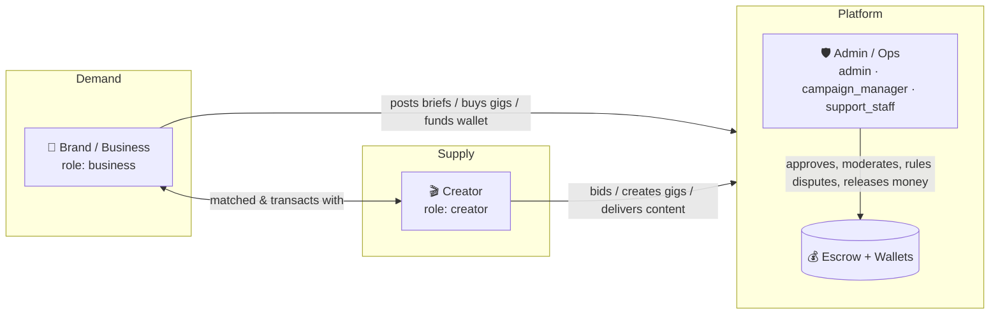
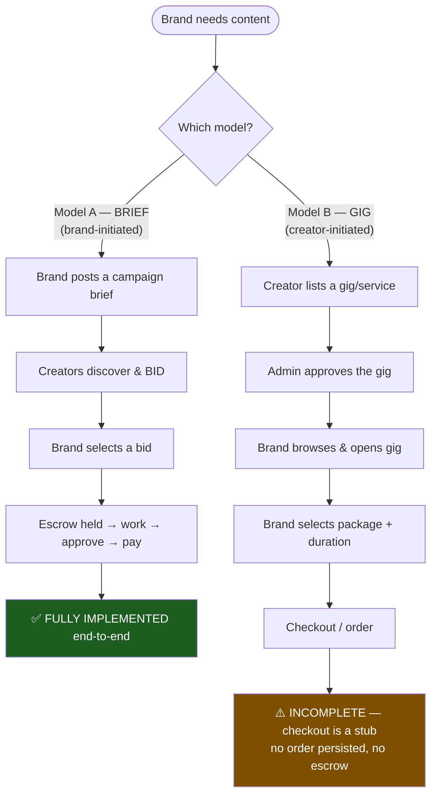
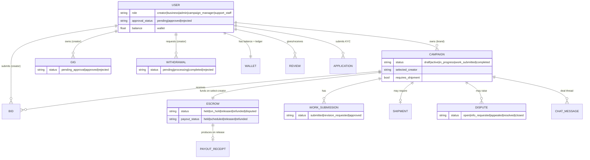
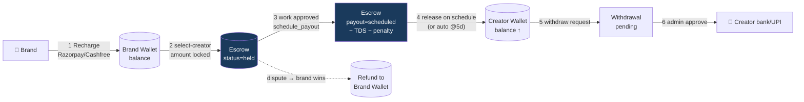

# UGCad.io — Platform Flow Documentation

> **Purpose:** A complete map of the software's flows across **Creator**, **Brand (Business)**, and **Admin** sides — both the **AS-IS (current, implemented)** flows and the **TO-BE (ideal, production-grade)** flows — plus the linkages and dependencies between them.
>
> **Source of truth:** Backend = `Backend/server.py` (FastAPI, ~9.1k lines) + `campaign_models.py`, `campaign_helpers.py`, `gigs.py`, `creator_features.py`, `storage.py`. Frontend = `C:\Users\meetr\Frontend\src` (React, react-router, axios).

## Document index

| File | Contents |
|------|----------|
| `00-OVERVIEW.md` (this) | System map, roles, entities, the two acquisition models, status vocabulawry |
| `01-CREATOR-FLOW.md` | Creator side — current vs ideal |
| `02-BRAND-FLOW.md` | Brand/Business side — current vs ideal |
| `03-ADMIN-FLOW.md` | Admin/Ops side — current vs ideal |
| `04-LINKAGES-AND-GAPS.md` | Cross-role linkages, dependency matrix, gap analysis & production roadmap |

> **Rendering note:** Diagrams are written in **Mermaid**. They render natively on GitHub, in VS Code (with a Mermaid preview extension), Obsidian, and most Markdown viewers.

---

## 1. What the product is

A **UGC (User-Generated Content) marketplace** connecting **Brands** that need short-form video content with **Creators** who produce it, mediated by an **Ops/Admin** team that gates trust, holds money in **escrow**, and resolves disputes.

It is an **India-first** platform: rupee (₹) pricing, GST validation on brand onboarding, **TDS** (Tax Deducted at Source) on creator payouts, and Razorpay/Cashfree payment rails.

### The three actors (+ ops sub-roles)

| Role (backend value) | Who | Core job |
|---|---|---|
| `creator` | Content creator | Build profile → win work → deliver → get paid |
| `business` | Brand | Fund wallet → source content → review → approve → own the content |
| `admin` | Founder / super-admin | Everything, incl. money, bans, settings, roles |
| `campaign_manager` | Ops (senior) | Approvals, shortlists, disputes (capped), payouts |
| `support_staff` | Ops (regular) | Approvals, moderation, lower-authority ops |

> **Permission model** lives in `utils/adminRoles.js` (frontend gating) and `OPS_ROLES` in `server.py:3776` (backend enforcement). Capability-based: `can(user, capability)`. Dispute authority is **money-capped** by role (Ops Regular ₹25K, Ops Senior ₹1L, Founder unlimited).

---

## 2. The two acquisition models (critical to understand)

The platform supports **two parallel ways** a brand and creator transact. Understanding the difference is the key to the whole system.

| | **Model A — Campaigns / Briefs** | **Model B — Gigs** |
|---|---|---|
| Initiated by | Brand | Creator |
| Discovery | Creators browse briefs (`BrowseBriefs`) | Brands browse gigs (`BrowseApprovedGigs`) |
| Matching | Bidding **or** ops-curated shortlist | Direct selection of a gig package |
| Admin gate | **None today** — briefs auto-publish (`server.py:3576`) | **Yes** — gig needs `approve` (`gigs.py`) |
| Money / escrow | ✅ Full escrow, TDS, payout, disputes | ❌ Not wired — purchase is a `toast()` stub (`GigDetailsPage.js:261`) |
| Status | **LIVE & complete** | **PARTIAL** — listing + approval + wishlist only |

> **Takeaway:** Today the platform effectively runs on **Model A (Briefs)**. Model B (Gigs) is a half-built second channel: creators can list, admins can approve, brands can browse/wishlist — but **no brand can actually buy a gig** because checkout is unimplemented.

---

## 3. Core entities & relationships

---

## 4. Status vocabulary (the state machines at a glance)

These statuses drive every screen. Full transition diagrams live in each role file; this is the master reference.

| Entity | States | Source |
|---|---|---|
| **User approval** | `pending → approved \| rejected` (rejected → re-apply) | `server.py:157-165`, `:6664` |
| **Application (KYC)** | `pending → more_info → approved \| rejected` | `applications.py:28-32` |
| **Campaign/Brief** | `draft → active → in_progress → work_submitted → completed` (`rejected` legacy) | `campaign_models.py:9-15` |
| **Gig** | `pending_approval → approved \| rejected` (`in_progress`,`completed`,`cancelled` future) | `gigs.py:46-52` |
| **Bid** | `pending → accepted (becomes selected_creator) \| rejected/lapsed` | `server.py /bid`, `/select-creator` |
| **Work submission** | `submitted → approved \| revision_requested → submitted …` (auto-approve @5d) | `server.py:171-175`, `:5434` |
| **Escrow** | `held → on_hold → released \| refunded \| disputed` | `server.py:4163`, `:5399`, `:5960` |
| **Payout (within escrow)** | `held → scheduled → released \| refunded` | `server.py:5322`, `:5384` |
| **Withdrawal** | `pending → processing → completed \| rejected` | `server.py:177-181`, `:6988` |
| **Shipment** | `pending → shipped/in_transit → delivered → received` (+ `disputed`) | `server.py:1307`, `:6484` |
| **Dispute** | `open → info_requested → appealed → resolved → closed` | `server.py:6012-6276` |
| **User account** | `active → suspended → banned` | `server.py:6924` |

---

## 5. The money flow (one picture)

**Key facts (verified in code):**
- Platform commission ≈ **20–25%** + **₹500 listing fee** per brief (`AdminSettings`, PostABrief Step 7).
- **Revisions:** first 2 free; ₹500 each after; admin escalation past 5 (`creator_features.py`, `server.py:5610`).
- **Late delivery penalty** ladder: minor 5% / moderate 10% / severe 15% (`server.py:5222`, `:5474`).
- **Auto-approval:** unreviewed work auto-approves & pays creator after **5 days** (`server.py:5434`).
- **TDS** withheld on payout unless `creator.tds_exempt` (`server.py:5322`).
- Payout speed tiered by creator level (New 12d → Elite 48h).

---

## 6. How to read the role files

Each of `01`/`02`/`03` is structured identically:

1. **Current (AS-IS) journey** — ordered steps + flowchart + the real screens/APIs.
2. **Current state machine** — what actually transitions today.
3. **Gaps & dead-ends** — what's stubbed, broken, or missing.
4. **Ideal (TO-BE) journey** — production-grade flow with the gaps closed.
5. **AS-IS vs TO-BE delta table.**

`04` ties it together: the cross-role sequence diagrams, the dependency matrix, and the prioritized roadmap to production.
