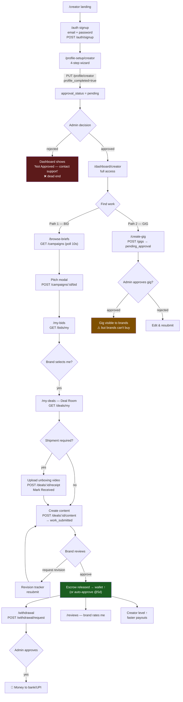
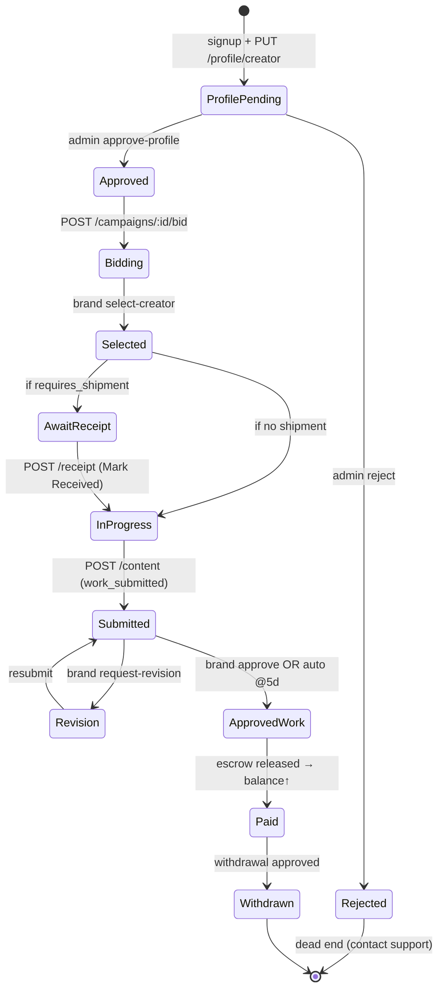
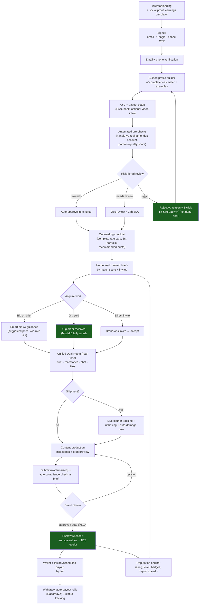
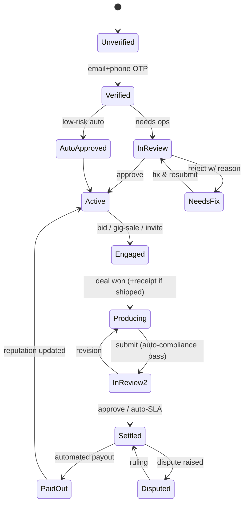

# Creator Side — Flow (Current vs Ideal)

> Role: `creator`. Entry landing: `/creator`. Gated by `approval_status === 'approved'`.

---

## PART A — CURRENT (AS-IS) FLOW

### A.1 End-to-end journey (current)

### A.2 Screens, what they do, key APIs

| Step | Screen (`src/pages`) | What the creator does | Key API(s) |
|---|---|---|---|
| Land | `CreatorLanding.js` | Marketing; CTA to signup | — (static) |
| Sign up | `CreatorSignup.js` | Email + password (Google = "coming soon" stub) | `POST /auth/signup` |
| Profile | `CreatorProfileSetup.js` | 4 steps: basics → contact → portfolio/skills/socials/languages → equipment/availability/rate | `POST /upload/file`, `PUT /profile/creator` |
| Dashboard | `CreatorDashboard.js` | Stats, level banner, active campaigns, earnings chart; **blocked until approved** | `GET /campaigns`, `/reviews/creator/:id`, `/auth/me` |
| Find work A | `BrowseBriefs.js` | Filter briefs (search, category, payout range, match score), **bid** | `GET /campaigns`, `/payout-ranges`; `POST /campaigns/:id/bid` |
| Bids | `MyBidsPage.js` | Track pending bids | `GET /bids/my` |
| Find work B | `CreateGig.js` | Create a service listing (title, category, budget, deadline, niches, styles, platforms, attachments) | `POST /gigs` |
| Deal room | `MyDealsPage.js` | The core workspace: brief, activity feed, shipment receipt, content submission, revisions, chat, payout summary | `GET /deals/my`; `POST /deals/:id/{receipt,content,chat,revision-response,damage-report,dispute,escalate}` |
| Active work | `MyActiveWorkPage.js` | Filtered list of assigned campaigns | `GET /campaigns` |
| Submit | `WorkSubmission.js` | Upload deliverables | `POST /work/submit` |
| Portfolio | `PortfolioPage.js` | Add/remove showcase items | `PATCH /profile/portfolio` |
| Reviews | `ReviewsPage.js` | Read brand ratings | `GET /reviews/creator/:id` |
| Payout | `WithdrawalPage.js` / `PayoutWithLayout.js` | KPIs, payment history, bank details, **request withdrawal** | `GET /payout/overview`, `/withdrawal/history`; `POST /withdrawal/request` |

### A.3 Creator state — what actually transitions

### A.4 Gaps & dead-ends (current)

| # | Gap | Where | Impact |
|---|---|---|---|
| 1 | **Google sign-up** is a toast stub | `CreatorSignup.js:53` | Only email/password works |
| 2 | **Gig channel dead for creators** — they can list & get approved, but no brand can buy | `CreateGig.js` + `GigDetailsPage.js:261` | Wasted effort; Model B is a dead end |
| 3 | **Rejected profile = hard dead end** — no re-apply / appeal UI | `CreatorDashboard.js` | Lost supply |
| 4 | **`/messages` & `/settings`** referenced in nav, thin/partial pages | nav links | Confusing navigation |
| 5 | **No real-time** — everything polls every 10s (`t=Date.now()`) | most pages | Laggy deal room & chat |
| 6 | **Dispute vs Escalate** both hit similar endpoints | `MyDealsPage.js:367` | Ambiguous creator intent |
| 7 | **Earnings chart is dummy data** (Jan–Jun hardcoded) | `CreatorDashboard.js` | Misleading metric |
| 8 | **Portfolio has no in-place edit / versioning** | `PortfolioPage.js` | Limited curation |
| 9 | **No onboarding nudge** between approval and first bid | flow gap | Slow time-to-first-bid |

---

## PART B — IDEAL (TO-BE) FLOW

### B.1 Production-grade creator journey

### B.2 What changes from current → ideal

| Area | Current (AS-IS) | Ideal (TO-BE) |
|---|---|---|
| Auth | Email/password only; Google stub | Email + Google + phone OTP; verified email/phone |
| Approval | Manual binary, reject = dead end | Risk-tiered (auto-approve low risk), <24h SLA, reject-with-fix loop |
| Onboarding | Drop into empty dashboard | Checklist + recommended briefs + earnings calculator |
| Work discovery | Browse + poll; dummy match score | Ranked feed, real match score, invites, win-rate hints |
| Gig channel | Listing dead-ends (no checkout) | Fully transactional (order → escrow → deliver) |
| Deal room | 10s polling | Real-time (WebSocket/SSE), milestones, draft previews |
| Compliance | Manual; brand catches issues | Auto-check submission against brief must-include/avoid |
| Payouts | Manual admin approval per withdrawal | Automated payout rails (RazorpayX/Cashfree Payouts) + receipts |
| Reputation | Level by count; dummy chart | Real analytics, badges, transparent payout-speed ladder |
| Reject/Disputes | Hard dead ends | Appeal + guided resolution paths |

### B.3 Ideal creator state machine (adds the missing transitions)

