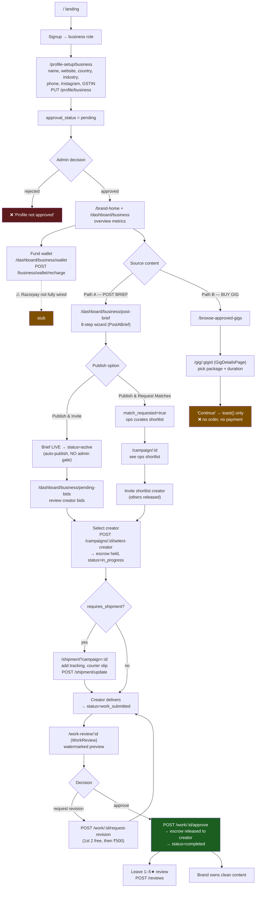
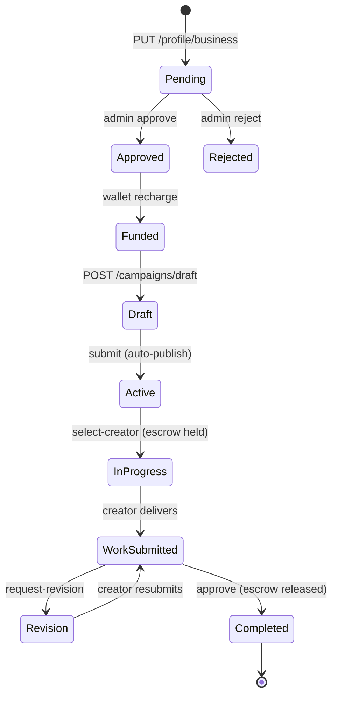
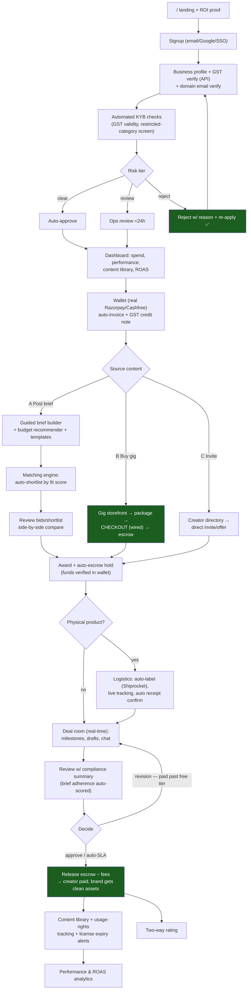
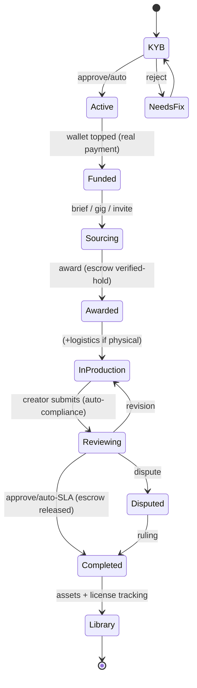

# Brand / Business Side — Flow (Current vs Ideal)

> Role: `business` (= **brand**). Landing: `/`. Gated by `approval_status === 'approved'`. Main hub: `BusinessDashboard.js` (renders sub-pages via a `page` prop).

---

## PART A — CURRENT (AS-IS) FLOW

### A.1 End-to-end journey (current)

> **Important reconciliation:** Frontend `AdminCampaigns.js` implies an admin *approves* briefs, but the **backend auto-publishes** briefs on submit (`server.py:3576-3577`, status → `active`, reason "auto-published"). So the brief approval gate is **legacy/inactive**. Gigs, by contrast, **do** require admin approval.

### A.2 Screens & sub-pages

| Area | Screen / sub-page | What the brand does | Key API(s) |
|---|---|---|---|
| Landing | `Landing.js` | Marketing, signup | — |
| Profile | `BusinessProfileSetup.js` | Business details + GSTIN | `PUT /profile/business` |
| Welcome | `BrandWelcomePage.js` | Status, curated gigs, search | `GET /campaigns`, `/gigs?status=approved`, `/categories` |
| Overview | `BusinessDashboard page="overview"` | Metrics, performance chart, creator funnel, active deals | `GET /business/dashboard`, `/campaigns` |
| Post brief | `PostABrief.js` (8 steps) | Basics → deliverables → must-include → must-avoid → style → usage rights → timeline/budget → review/publish | `POST /campaigns/draft`, `PATCH /campaigns/:id`, `POST /campaigns/:id/submit` |
| Bids | `page="pending-bids"` | Review bids; view profile; chat; select | `GET /campaigns`; `POST /campaigns/:id/select-creator` |
| Shortlist | `CampaignDetails.js` | View ops shortlist, invite, request new | `GET /campaigns/:id/shortlist`; `POST …/invite`, `…/request-new` |
| Browse creators | `page="browse-creator"` | Directory w/ filters; invite | `GET /business/creator-directory`; `POST …/:id/invite` |
| Browse gigs | `BrowseApprovedGigs.js` | Filter approved gigs | `GET /gigs?status=approved` |
| Gig detail | `GigDetailsPage.js` | Package/duration; wishlist; (buy = stub) | `GET /gigs/:id`, `/profile/:creatorId`, `/reviews/creator/:id`; `POST /gigs/:id/wishlist` |
| Work review | `WorkReview.js` | Approve / request revision; rate | `GET /work/:id`; `POST /work/:id/approve`, `…/request-revision`; `POST /reviews` |
| Shipments | `page="shipments"` + `ShipmentTracking.js` | Add tracking, checklist, view unboxing | `GET /shipment/:campaignId`; `POST /shipment/update` |
| Wallet | `page="wallet"` | Balance, recharge, transactions | `GET /business/wallet`; `POST /business/wallet/recharge` |
| All campaigns | `page="all-campaigns"` | List/manage campaigns + drafts | `GET /campaigns`, `?status=draft` |

### A.3 Brand state — what actually transitions

### A.4 Gaps & dead-ends (current)

| # | Gap | Where | Impact |
|---|---|---|---|
| 1 | **Wallet recharge not fully wired** to Razorpay SDK | `BusinessDashboard.js:531` | Brands can't reliably add funds |
| 2 | **Gig purchase (Path B) is a stub** — "Continue" only toasts | `GigDetailsPage.js:261` | Entire direct-buy channel non-functional |
| 3 | **Contact-creator from gig browse** is a toast stub | `BrowseApprovedGigs.js:124` | Can't initiate from gig |
| 4 | **Creator-directory** may 404 if backend missing | `BusinessDashboard.js:439` | Browse-creator empty |
| 5 | **Escrow funding ambiguity** — escrow created on select-creator but wallet debit timing unclear vs recharge | backend | Reconciliation risk |
| 6 | **Brief approval is legacy** — frontend admin approval contradicts backend auto-publish | `AdminCampaigns.js` vs `server.py:3576` | Confusing/dead admin path |
| 7 | **Dispute from brand side** skeletal in shipment | `ShipmentTracking.js:310` | No resolution path UI |
| 8 | **No campaign performance after-the-fact** (views, ROAS) | overview | Limited proof of value |

---

## PART B — IDEAL (TO-BE) FLOW

### B.1 Production-grade brand journey

### B.2 Current → ideal delta

| Area | Current | Ideal |
|---|---|---|
| Onboarding | Manual GSTIN text field | GST verified via API; KYB auto-screen; reject-with-fix loop |
| Wallet | Recharge stub | Live payments + auto GST invoices/credit notes |
| Gig channel | Browse only (no buy) | Full storefront → checkout → escrow → delivery |
| Matching | Manual ops shortlist or raw bids | Fit-score matching engine + side-by-side bid compare |
| Escrow | Created on select, debit timing fuzzy | Verified hold against funded wallet; clear ledger |
| Shipping | Manual tracking entry | Auto-label + live tracking + auto receipt |
| Review | Watermark preview, manual judgment | Auto compliance score vs brief; structured feedback |
| Post-sale | None | Content library, usage-rights/license tracking, ROAS |
| Approval gate | Legacy/contradictory | Removed for briefs (consistent) or risk-based moderation |

### B.3 Ideal brand state machine

