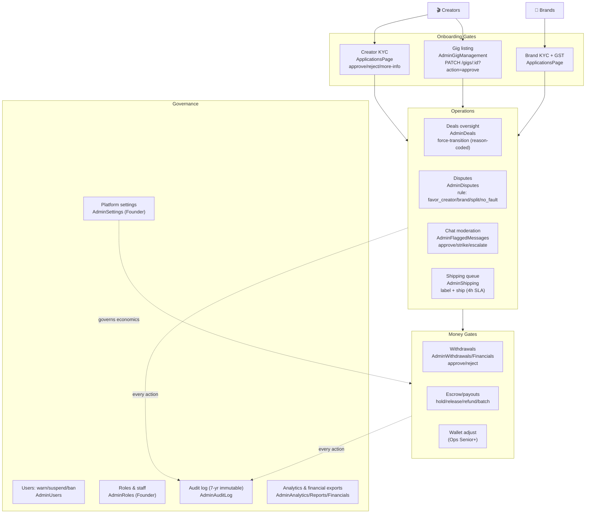
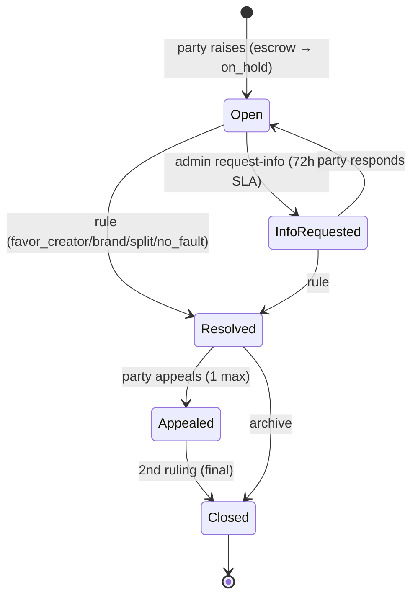
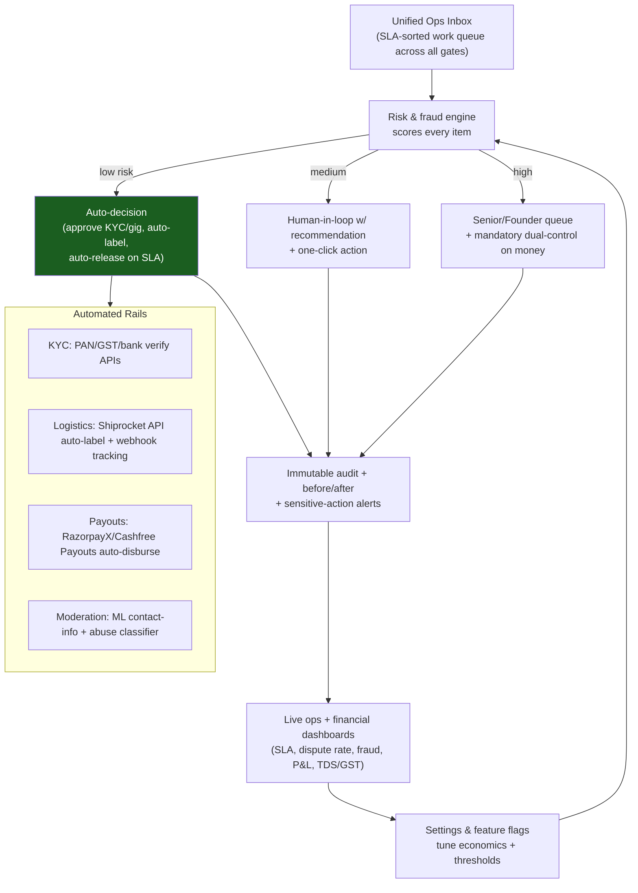
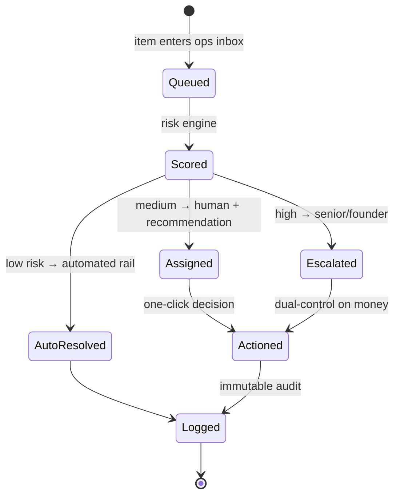

# Admin / Ops Side — Flow (Current vs Ideal)

> Roles: `admin` (Founder), `campaign_manager` (Ops Senior), `support_staff` (Ops Regular) + a **Finance** role in the capability model. Hub: `AdminDashboard.js` + `AdminLayout/Sidebar/Topbar`. Permission model: `utils/adminRoles.js` (`can(user, capability)`); backend `OPS_ROLES` (`server.py:3776`).

---

## PART A — CURRENT (AS-IS) FLOW

### A.1 The admin sits on the critical path as a set of GATES

### A.2 Capability / role matrix (from `adminRoles.js`)

| Capability | Founder | Ops Senior | Ops Regular | Finance |
|---|:--:|:--:|:--:|:--:|
| review_applications | ✅ | ✅ | ✅ | — |
| manage_deals | ✅ | ✅ | ✅ | — |
| rule_disputes (cap) | ✅ ∞ | ✅ ₹1L | ✅ ₹25K | — |
| manage_shipping | ✅ | ✅ | ✅ | — |
| release_payouts | ✅ | ✅ | ✅ | — |
| adjust_wallet | ✅ | ✅ | — | — |
| warn_suspend_users | ✅ | ✅ | — | — |
| ban_users | ✅ | — | — | — |
| view_financials | ✅ | ✅ | — | ✅ |
| generate_reports / export_tax | ✅ | ✅ | ✅ | ✅ |
| user_management | ✅ | ✅ | — | — |
| content_moderation | ✅ | ✅ | ✅ | — |
| manage_roles / edit_settings | ✅ | — | — | — |
| view_audit | ✅ | ✅ | ✅ | ✅ |

### A.3 The gates with APIs & transitions

| Gate | Screen | API | Transition |
|---|---|---|---|
| Creator/Brand KYC | `ApplicationsPage.js` | `POST /admin/applications/:type/:id/{approve\|reject\|request-more-info}` | `pending → approved \| rejected \| more_info` |
| Gig | `AdminGigManagement.js` | `PATCH /gigs/:id?action=approve\|reject` | `pending_approval → approved \| rejected` |
| ~~Campaign~~ (legacy) | `AdminCampaigns.js` | `POST /admin/approve-campaign` | **Inactive** — briefs auto-publish (`server.py:3576`) |
| Deal | `AdminDeals.js` | `POST /admin/deals/:id/force-transition` | any → any (reason-coded) |
| Dispute | `AdminDisputes.js` | `POST /admin/disputes/:id/rule` | `open → resolved` (+ escrow split) |
| Moderation | `AdminFlaggedMessages.js` | `POST /admin/message/moderate` | flagged → approved \| strike \| escalate |
| Shipping | `AdminShipping.js` | `POST /admin/shipping/:id/{label\|ship}` | `pending → shipped` |
| Withdrawal | `AdminWithdrawals.js` | `POST /admin/withdrawals/:id/{approve\|reject}` | `pending → processing \| rejected` |
| Escrow/payout | `AdminFinancials.js` | `POST /admin/payouts/{:id/hold,:id/release,batch-release}`, `/admin/escrow/:id/{release,refund}` | held → released \| refunded |
| Users | `AdminUsers.js` | `POST /admin/user/{ban\|update}` | active → suspended \| banned |
| Roles | `AdminRoles.js` | `POST /admin/staff/{role\|revoke\|categories}` | — |
| Settings | `AdminSettings.js` | `PUT /admin/settings` | commission, fees, payout delays, etc. |
| Audit | `AdminAuditLog.js` | `GET /admin/audit-logs` | read-only, 7-yr, before/after snapshots |

### A.4 Dispute resolution flow (current)

### A.5 Gaps & dead-ends (current)

| # | Gap | Where | Impact |
|---|---|---|---|
| 1 | **Shipping label auto-gen not live** — manual Shiprocket | `AdminShipping.js:147` | 4h SLA at risk; manual toil |
| 2 | **Legacy campaign approval** contradicts auto-publish | `AdminCampaigns.js` | Dead/confusing path; no real moderation of briefs |
| 3 | **Two gig/profile approval surfaces** (AdminGigManagement vs ApplicationsPage) | both | Unclear ownership |
| 4 | **Redundant campaign views** (AdminCampaigns vs AdminAllCampaigns) | both | Clutter |
| 5 | **Filter-rule proposal lacks senior-approval workflow** | `AdminFlaggedMessages.js:147` | Governance gap |
| 6 | **Old "stats" dashboard tab = dead code** | `AdminDashboard.js` | Maintenance burden |
| 7 | **Manual, reactive everything** — no SLA dashboards/queues prioritization beyond color codes | global | Doesn't scale |
| 8 | **No fraud/risk scoring** feeding the gates | global | Manual judgment only |

---

## PART B — IDEAL (TO-BE) FLOW

### B.1 From manual gatekeeper → risk-based control tower

### B.2 Current → ideal delta

| Area | Current | Ideal |
|---|---|---|
| Work intake | Per-page queues, color-coded | Single SLA-sorted ops inbox across all gates |
| Decisions | Fully manual | Risk-tiered: auto / assisted / escalated |
| KYC/KYB | Manual review + regex GST check | PAN/GST/bank verification APIs, auto-screen |
| Shipping | Manual labels in Shiprocket | API auto-label (<60s) + webhook tracking |
| Payouts | Manual approve each withdrawal | Automated disbursement rails + exception-only review |
| Moderation | Regex + manual | ML classifier + proposal→senior-approval workflow |
| Money controls | Single-admin actions | Dual-control + role money-caps enforced server-side |
| Visibility | Static reports/exports | Live dashboards: SLA, dispute %, fraud, P&L, TDS/GST |
| Governance | Audit log exists | Audit + anomaly alerts + periodic access review |
| Brief moderation | Legacy/contradictory | Either none (consistent auto-publish) or risk-based spot-check |

### B.3 Ideal: a single ops work-item lifecycle

> **North star:** the admin's role shifts from *approving everything* to *governing thresholds and handling exceptions* — automation clears the low-risk bulk, humans focus on judgment calls, and every money movement carries dual-control + an immutable trail.
