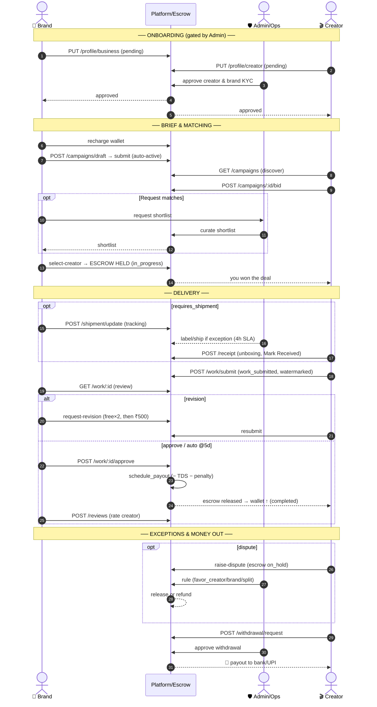
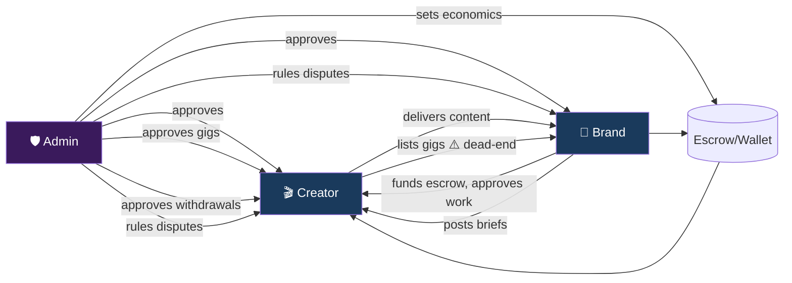
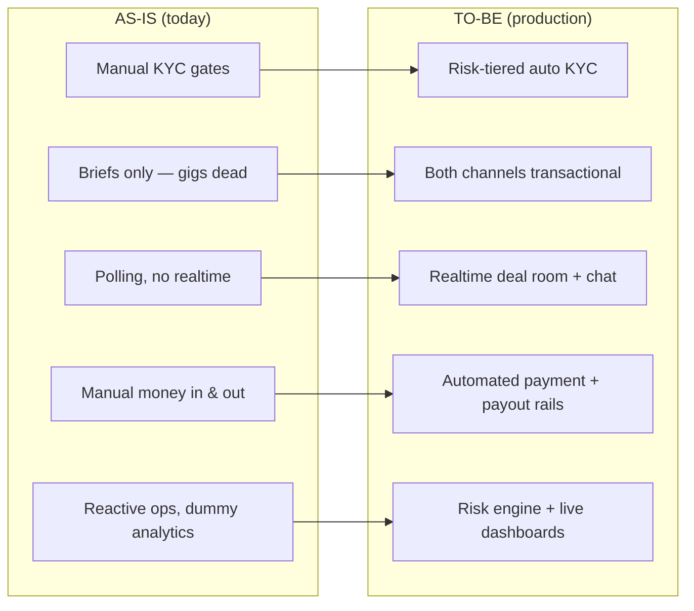
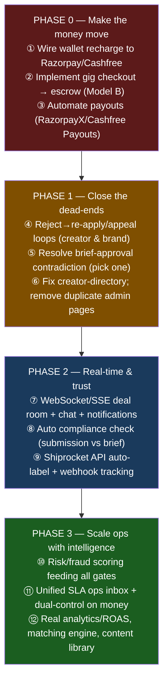
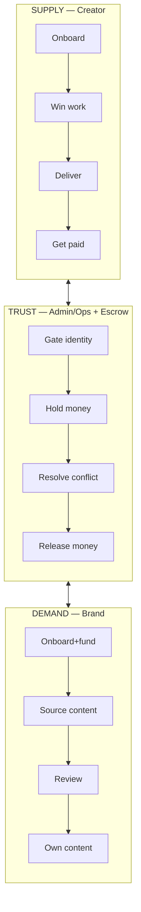

# Linkages, Dependencies & Production Roadmap

> How the three sides connect, what each side **depends on** from the others, where the chain **breaks today**, and the prioritized path to a production-grade platform.

---

## 1. The full cross-role lifecycle (Model A — Briefs, the live path)

This is the canonical end-to-end sequence that all three actors participate in.

---

## 2. Dependency matrix — who depends on whom

| This step… | …is blocked until | Owner | Cross-dependency |
|---|---|---|---|
| Creator can bid | creator `approval_status=approved` | Admin | **Creator → Admin** |
| Brand can post brief | brand `approval_status=approved` | Admin | **Brand → Admin** |
| Creator can be paid | brand funded wallet + selected + approved work | Brand | **Creator → Brand** |
| Brief visible to creators | brief submitted (auto-publish) | Brand | **Creator → Brand** |
| Gig visible to brands | gig `approved` | Admin | **Creator → Admin** |
| Escrow released | brand approves OR 5-day auto-approve | Brand/System | **Creator → Brand/System** |
| Withdrawal paid | admin approves withdrawal | Admin | **Creator → Admin** |
| Shipment received gate | brand ships + creator confirms | Brand+Creator | **mutual** |
| Dispute resolved | admin ruling (within role money-cap) | Admin | **Brand+Creator → Admin** |
| Chat stays open | brand wallet ≥ min_chat_balance (₹5K) | Brand | **Creator ↔ Brand → Brand wallet** |

### Dependency graph

**Critical-path insight:** the Admin gates **both ends of supply and demand** *and* the money exit. Any latency in KYC approval, dispute ruling, or withdrawal approval directly throttles GMV. This is the #1 reason the ideal flow (file `03`) pushes for **risk-tiered automation** of these gates.

---

## 3. Where the chain breaks today (consolidated gap register)

| Severity | Gap | Side | File / ref | Consequence |
|---|---|---|---|---|
| 🔴 Critical | **Gig checkout unimplemented** (Model B) | Brand+Creator | `GigDetailsPage.js:261` | Half the marketplace (creator-initiated) earns ₹0 |
| 🔴 Critical | **Wallet recharge not fully wired** to gateway | Brand | `BusinessDashboard.js:531` | Brands struggle to fund → no escrow → no deals |
| 🔴 Critical | **Withdrawal & payout fully manual** | Creator+Admin | `server.py:6988` | Ops bottleneck; slow creator payouts |
| 🟠 High | **Legacy brief-approval vs auto-publish** mismatch | Brand+Admin | `AdminCampaigns.js` vs `server.py:3576` | Dead admin path; no brief quality control |
| 🟠 High | **No real-time** (10s polling everywhere) | All | most pages | Laggy deal room/chat, stale data |
| 🟠 High | **Reject = dead end** (creator & brand) | Creator+Brand | dashboards | Lost supply/demand, no appeal |
| 🟠 High | **Shipping labels manual** | Admin | `AdminShipping.js:147` | SLA risk, ops toil |
| 🟡 Medium | **Dummy analytics** (earnings chart, some metrics) | Creator+Brand | dashboards | Misleading; no real proof of value |
| 🟡 Medium | **Creator-directory may 404** | Brand | `BusinessDashboard.js:439` | Browse-creator empty |
| 🟡 Medium | **Dispute vs escalate ambiguity** | Creator | `MyDealsPage.js:367` | Mis-routed exceptions |
| 🟡 Medium | **Redundant/duplicate admin surfaces** | Admin | AdminCampaigns/AllCampaigns; GigMgmt/Applications | Maintenance + confusion |
| 🟢 Low | Google sign-up stub; settings/messages thin | All | `CreatorSignup.js:53` | Minor friction |

---

## 4. AS-IS vs TO-BE at a glance (per side)

---

## 5. Prioritized roadmap to production

| Phase | Theme | Why first | Unblocks |
|---|---|---|---|
| **0** | Money plumbing | Without funding + payout + gig checkout, the marketplace can't transact at scale | All revenue |
| **1** | Remove dead-ends & contradictions | Stops silent supply/demand leakage and confusion | Conversion, data integrity |
| **2** | Real-time + trust automation | UX parity with competitors; reduces disputes | Retention, lower dispute rate |
| **3** | Ops intelligence | Lets the team scale GMV without linear headcount | Margin, throughput |

---

## 6. One-page mental model

> **The product in one sentence:** Admin **gates trust and holds money** so that Brands can **source content with confidence** and Creators can **get paid reliably** — and the path to production is to **automate that trust + money machinery** so it works without a human on every step.
